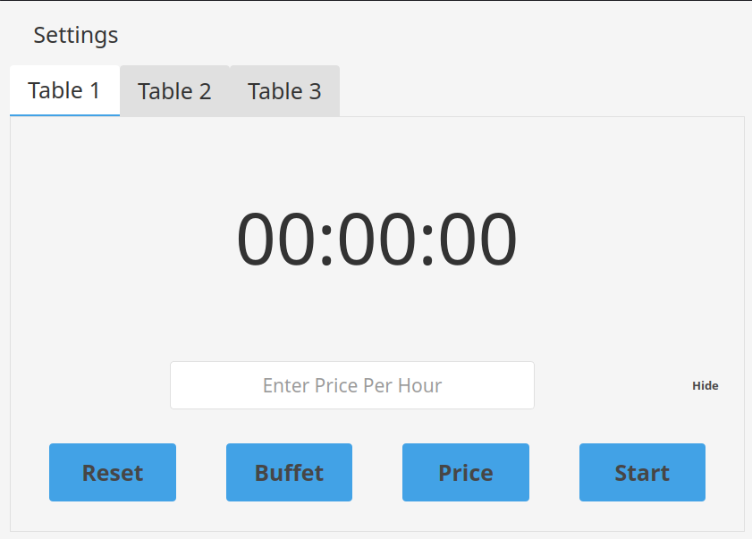
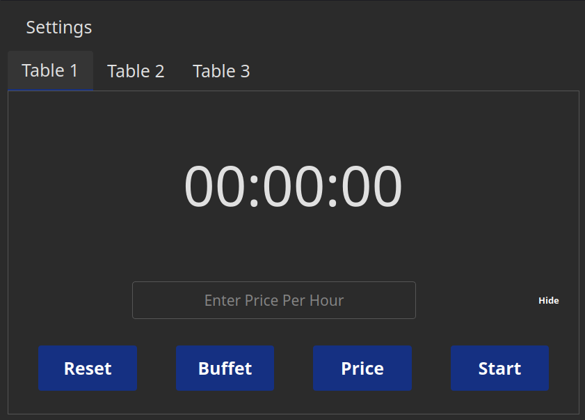
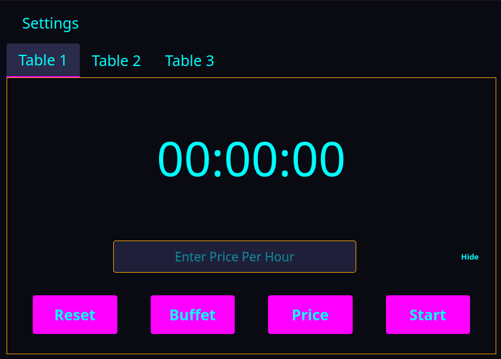
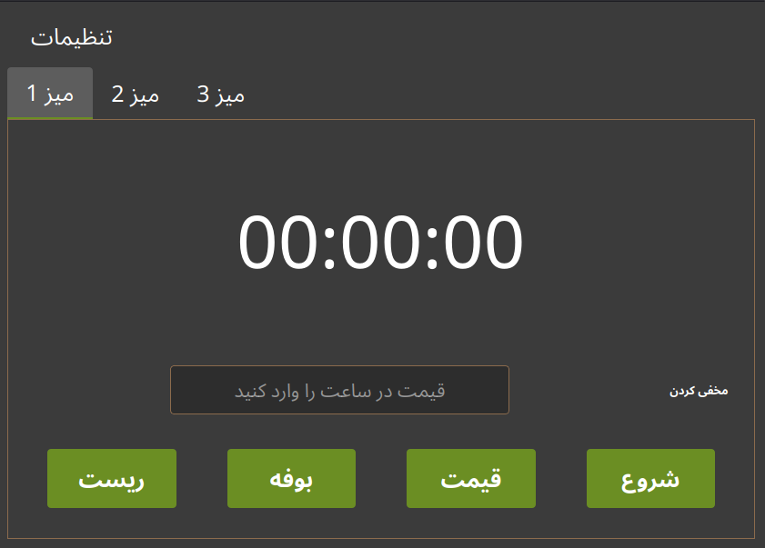

# Phoenix

A graphical desktop application for managing tables in Gamenet environments.

## Overview

Phoenix is a Python-based GUI tool designed to simplify table management tasks through a clean interface and configurable system.  
It supports themes, multiple languages, and flexible configuration handling to adapt to different setups.

## Features

- A user-friendly graphical interface
- Centralized configuration management
- Theme customization
- Multi-language support

## Screenshots

